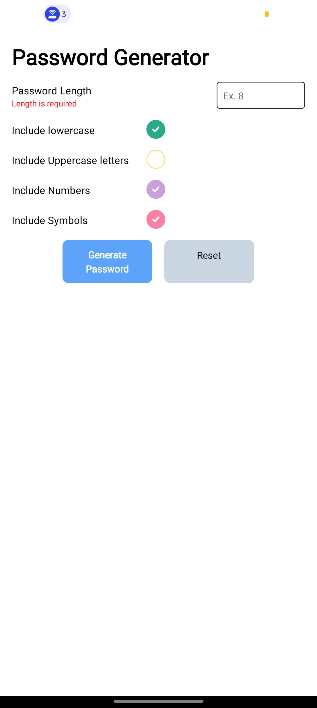
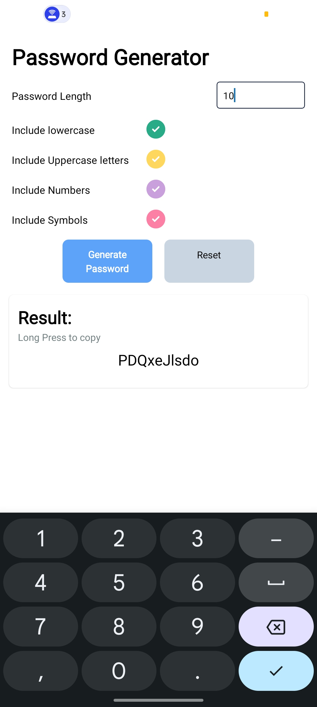

# Password Generator App 📱🔐

Welcome to the **Password Generator App**, a simple and efficient tool built using **React Native** and **Expo**. This app allows users to generate secure and customizable passwords based on their preferences.

---

## 🛠️ Features

- Generate passwords of user-defined length.
- Options to include:
  - Lowercase letters
  - Uppercase letters
  - Numbers
  - Symbols
- Form validation using **Yup**.
- Clean and intuitive UI with **Formik** for easy form management.
- Copy generated password functionality.

---

## 🚀 Getting Started

Follow these steps to get the project up and running on your local environment.

### Prerequisites

Make sure you have the following installed:

- [Node.js](https://nodejs.org/)
- [Expo CLI](https://docs.expo.dev/get-started/installation/)
- A mobile device with **Expo Go** app or an emulator (iOS/Android).

### Installation

1. Clone this repository:

   ```bash
   git clone https://github.com/yourusername/password-generator-app.git
   cd password-generator-app
   ```

2. Install dependencies:

   ```bash
   npm install
   ```

3. Start the development server:

   ```bash
   npx expo start
   ```

4. Open the app:

- Scan the QR code using the Expo Go app on your mobile device.
- Or use an emulator (Android/iOS).

## 📂 Project Structure
```markdown
password-generator-app/
├── App.js # Main application logic
├── package.json # Project dependencies and metadata
├── node_modules/ # Installed npm packages
└── README.md # Project documentation
```

## 🛠️ Tech Stack

- **React Native**: Build the cross-platform mobile app.
- **Expo**: Simplifies the development process with a powerful toolkit.
- **Formik**: Simplifies form management.
- **Yup**: Provides schema validation for form inputs.

---

## 📚 Libraries Used

### 1. **Formik**

- A library for building forms in React.
- Used here for managing the form state and handling submissions.
- **Official Documentation**: [Formik](https://formik.org/)

### 2. **Yup**

- A JavaScript schema builder for runtime value parsing and validation.
- Used to ensure password length is between 4 and 16 characters.
- **Official Documentation**: [Yup](https://github.com/jquense/yup)

### 3. **BouncyCheckbox**

- Provides animated checkboxes.
- Used for toggling the inclusion of password components.

### 4. **React Native Components**

- Core components such as `Text`, `TextInput`, `TouchableOpacity`, and `View` are used for UI creation.

---

## 🎨 UI Preview

**Screenshots !!!**

**Here’s how the app looks:**



**Here’s how it generate Password**


---

## 🔍 How It Works

1. Input the desired password length.
2. Toggle checkboxes to include/exclude character types.
3. Click **Generate Password** to get a secure password.
4. Long press the generated password to copy it to the clipboard.

---

## 📝 Validation Rules

The app uses **Yup** for form validation:

- Password length must be between **4** and **16**.
- An error message is displayed if validation fails.

---

## 🤝 Contributing

Contributions are welcome! Feel free to:

- Fork the repository.
- Create a new branch.
- Submit a pull request with your changes.

---

## 🌟 Acknowledgments

- [Formik](https://formik.org/) for simplified form management.
- [Yup](https://github.com/jquense/yup) for robust validation.
- The **React Native** and **Expo** communities for excellent resources and support.

---

## 📞 Support

If you encounter any issues or have suggestions, please feel free to [open an issue](https://github.com/Jayesh445/password-generator-app/issues).

---

Enjoy the app! 🚀🔐
